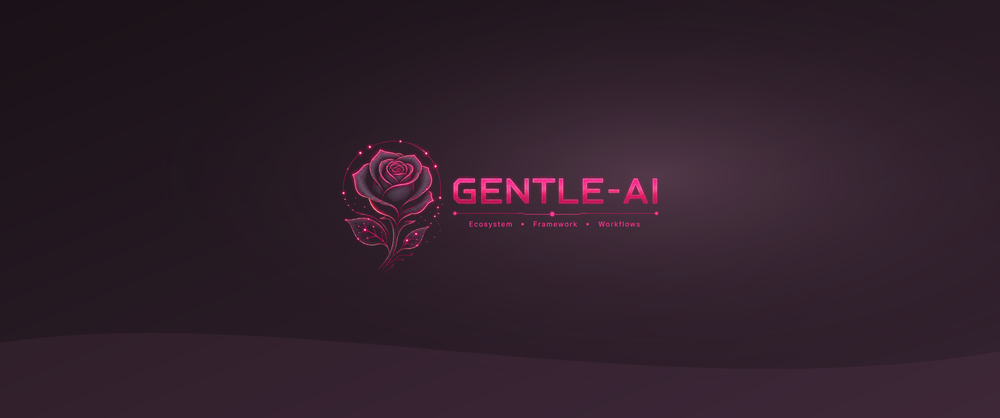
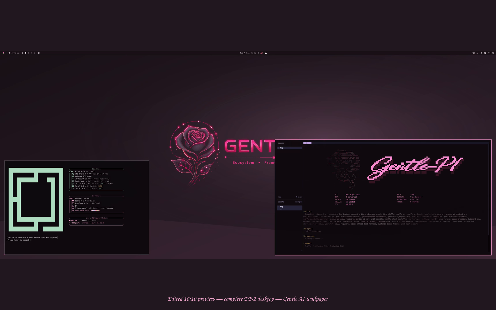
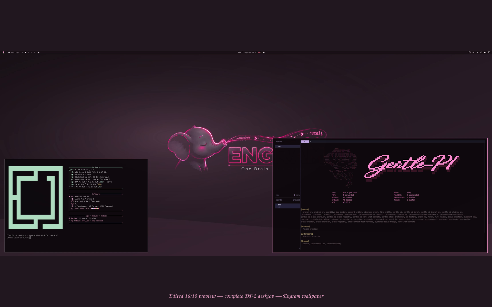
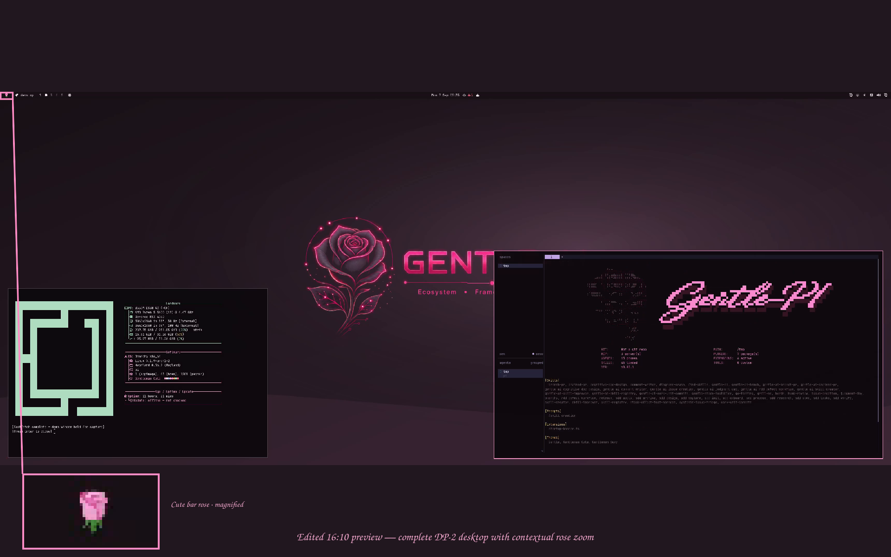

# Gentleman Theme Cute

A modern Omarchy color theme with four Gentle AI and Engram wallpapers.

## Wallpaper previews

These are wallpaper artwork previews, not full desktop screenshots or app coverage.

### Gentle AI



[3440×1440 PNG](backgrounds/gentle-ai-3440x1440.png) · [3840×2160 PNG](backgrounds/gentle-ai-3840x2160.png)

### Engram


[3440×1440 PNG](backgrounds/engram-3440x1440.png) · [3840×2160 PNG](backgrounds/engram-3840x2160.png)

## Desktop screenshots (custom setup)

These approved captures illustrate a custom desktop setup; they are not a claim of Omarchy's default appearance.



*Gentle AI wallpaper with system information and a Pi startup banner; the banner does not represent a complete Gentle Pi installation.*



*Engram wallpaper with system information and a Pi startup banner.*



*Gentle AI wallpaper with a contextual magnification of the Cute bar rose.*

The bar rose, lock screen, screensaver, terminal multiplexer, and other custom UI extras shown across these captures are separate configuration and are not installed by this theme package. These captures do not validate lock-screen PAM behavior.

## Screensaver demo (optional setup)


This animation records a separate Cute screensaver setup. Installing this theme does not install or configure it.

## Install

> **Warning:** this command installs and activates the theme.

```sh
omarchy theme install https://github.com/kattsushi/omarchy-gentleman-theme-cute
```

To select it manually later:

```sh
omarchy theme set gentleman-theme-cute
```

Omarchy generates its supported terminal configuration from `colors.toml`.
This repository bundles no terminal configuration, Foot background, theme-set hook,
bar, lock-screen, screensaver, Gentle Pi dependency, or installer behavior.

## License and marks

Copyright 2026 Andres David Jimenez. The original theme arrangement and documentation
in this repository are MIT-licensed. Third-party logos and marks are not licensed
under MIT and no trademark rights are granted; see [ATTRIBUTION.md](ATTRIBUTION.md).
